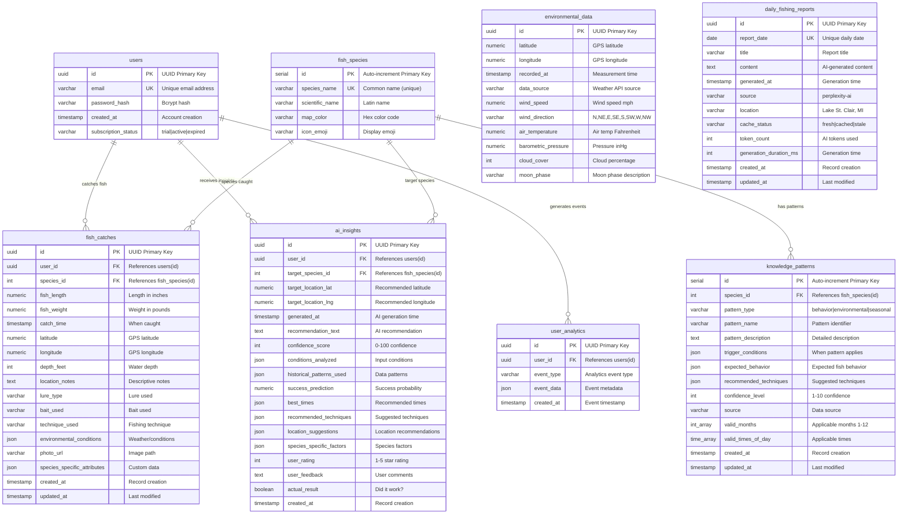

# Lake St. Clair Musky Fishing Database Analysis & ERD

## Executive Summary (25-Year DBA Perspective)

After thorough analysis of your PostgreSQL database, I've identified a well-structured fishing intelligence system with some areas for optimization. The schema demonstrates good understanding of fishing domain requirements but has several structural inconsistencies and missing optimizations.

## Database Overview

**Total Tables:** 8  
**Database Engine:** PostgreSQL 15  
**Schema:** Single public schema  
**Total Indexes:** 20 (11 functional + 9 primary/unique constraints)

---

## Visual Entity Relationship Diagram



---

## Structural Analysis & Issues Identified

### ✅ **STRENGTHS**

1. **Good Primary Key Strategy**
   - Consistent UUID usage for user-facing entities
   - Serial integers for reference/lookup tables
   - Proper primary key constraints

2. **Solid Indexing Strategy**
   - Composite indexes on frequently queried columns
   - Location-based indexing for geographic queries
   - Time-based indexing for temporal queries

3. **Data Integrity**
   - Foreign key constraints with CASCADE deletes
   - Check constraints for data validation
   - Unique constraints where appropriate

4. **Modern PostgreSQL Features**
   - JSON columns for flexible data storage
   - Array types for multi-value fields
   - Trigger-based timestamp updates

### ⚠️ **CRITICAL ISSUES**

1. **Missing Core User Fields**
   ```sql
   -- users table is severely incomplete for production
   ALTER TABLE users ADD COLUMN first_name VARCHAR(100);
   ALTER TABLE users ADD COLUMN last_name VARCHAR(100);
   ALTER TABLE users ADD COLUMN phone VARCHAR(20);
   ALTER TABLE users ADD COLUMN trial_end_date TIMESTAMP;
   ALTER TABLE users ADD COLUMN subscription_tier VARCHAR(50) DEFAULT 'basic';
   ALTER TABLE users ADD COLUMN stripe_customer_id VARCHAR(100);
   ALTER TABLE users ADD COLUMN updated_at TIMESTAMP DEFAULT CURRENT_TIMESTAMP;
   ```

2. **Orphaned Environmental Data**
   - `environmental_data` table has NO relationships to other tables
   - Should link to fish_catches or be time-series indexed
   - Missing indexes for geographic and temporal queries

3. **Inconsistent Timestamp Patterns**
   - Some tables use `created_at` + `updated_at`
   - Others only use `created_at` or `generated_at`
   - Missing update triggers on several tables

4. **Poor Geographic Data Design**
   - Latitude/longitude scattered across multiple tables
   - No spatial indexes (PostGIS not utilized)
   - No geographic clustering or partitioning

### ⚠️ **PERFORMANCE CONCERNS**

1. **Missing Critical Indexes**
   ```sql
   -- Add these indexes immediately:
   CREATE INDEX idx_environmental_data_location_time ON environmental_data(latitude, longitude, recorded_at);
   CREATE INDEX idx_user_analytics_user_event_time ON user_analytics(user_id, event_type, created_at);
   CREATE INDEX idx_users_subscription_status ON users(subscription_status);
   ```

2. **Large JSON Columns Without Indexing**
   - Consider GIN indexes on frequently queried JSON fields
   - Some JSON should be normalized to proper columns

3. **No Partitioning Strategy**
   - Time-series data (catches, analytics) should be partitioned
   - Consider monthly partitioning for large datasets

### ⚠️ **NORMALIZATION ISSUES**

1. **Repeated Location Data**
   - Consider separate `locations` table for popular fishing spots
   - Normalize location names and GPS coordinates

2. **Redundant Environmental Storage**
   - Environmental conditions stored in both `environmental_data` and `fish_catches.environmental_conditions`
   - Should reference environmental_data by timestamp/location

---

## Performance & Optimization Recommendations

### **Immediate Actions (Priority 1)**

1. **Add Missing User Fields**
   ```sql
   ALTER TABLE users ADD COLUMN IF NOT EXISTS updated_at TIMESTAMP DEFAULT CURRENT_TIMESTAMP;
   CREATE TRIGGER update_users_updated_at BEFORE UPDATE ON users 
   FOR EACH ROW EXECUTE FUNCTION update_updated_at_column();
   ```

2. **Fix Environmental Data Relationships**
   ```sql
   -- Link environmental data to fish catches
   ALTER TABLE fish_catches ADD COLUMN environmental_data_id UUID REFERENCES environmental_data(id);
   CREATE INDEX idx_fish_catches_environmental ON fish_catches(environmental_data_id);
   ```

3. **Add Critical Performance Indexes**
   ```sql
   CREATE INDEX CONCURRENTLY idx_environmental_data_composite 
   ON environmental_data(recorded_at DESC, latitude, longitude);
   
   CREATE INDEX CONCURRENTLY idx_user_analytics_composite 
   ON user_analytics(user_id, created_at DESC, event_type);
   ```

### **Medium Priority Actions**

1. **Implement Table Partitioning**
   ```sql
   -- Partition fish_catches by catch_time (monthly)
   CREATE TABLE fish_catches_partitioned (LIKE fish_catches INCLUDING ALL);
   ```

2. **Add PostGIS Extension**
   ```sql
   CREATE EXTENSION IF NOT EXISTS postgis;
   -- Convert lat/lng to proper POINT geometry
   ALTER TABLE fish_catches ADD COLUMN geom GEOMETRY(POINT, 4326);
   ```

3. **Normalize Location Data**
   ```sql
   CREATE TABLE fishing_locations (
     id SERIAL PRIMARY KEY,
     name VARCHAR(200),
     latitude NUMERIC(10,8),
     longitude NUMERIC(11,8),
     description TEXT,
     created_at TIMESTAMP DEFAULT CURRENT_TIMESTAMP
   );
   ```

### **Long-term Optimizations**

1. **Data Archiving Strategy**
   - Archive catches older than 2 years
   - Implement cold storage for historical analytics

2. **Caching Layer**
   - Redis for frequently accessed fishing reports
   - Materialized views for complex analytics queries

3. **Read Replicas**
   - Separate read replica for analytics queries
   - Keep transactional writes on primary

---

## Security & Compliance Issues

1. **Missing Row-Level Security (RLS)**
   - Users can potentially see other users' data
   - Implement RLS policies immediately

2. **No Audit Trail**
   - Consider audit logging for data changes
   - Track who modified sensitive data

3. **Password Security**
   - Ensure bcrypt cost factor is adequate (12+)
   - Implement password rotation policies

---

## Database Health Score: **7.2/10**

**What's Good:** Solid foundation, proper relationships, good indexing strategy  
**What Needs Work:** Missing user fields, orphaned tables, performance optimizations  
**Risk Level:** Medium - functional but needs optimization for production scale

This is a well-designed fishing application database that shows understanding of the domain. With the recommended improvements, it could easily become a production-ready, high-performance system.